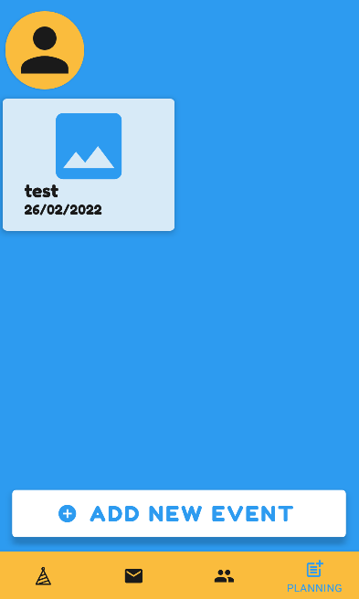
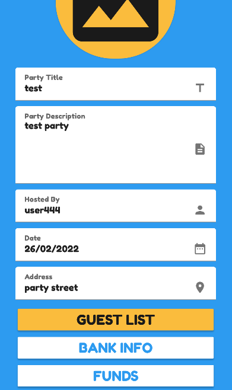
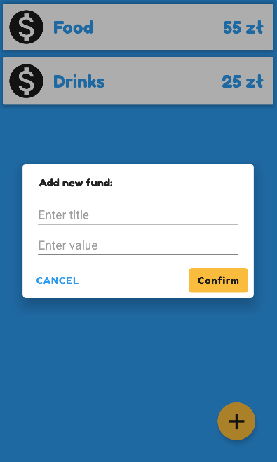
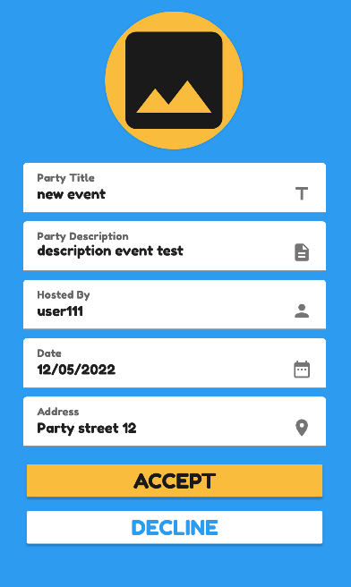
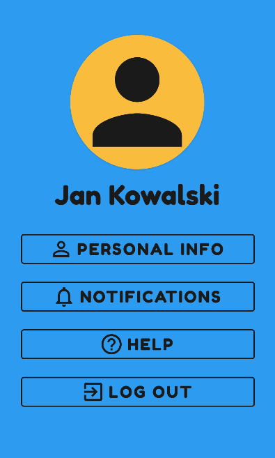

# Party Planner

## Table of contents
* [General info](#general-info)
* [Technologies](#technologies)
* [Setup](#setup)
* [Architecture](#architecture)

## General info
Application for android devices. Its purpose is to facilitate the organization of events. Its main functionalities are: adding events, adding rebounds related to events, managing the guest list, managing the friends list.
	
## Technologies
Project is created with:
* Kotlin
* Firebase
* MaterialUI
	
## Screenshots

  

  

  

  

  

  

  

  

